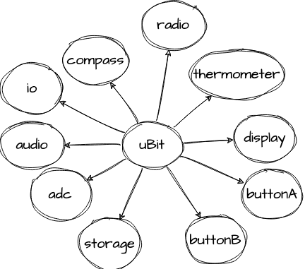

The uBit Object
===============

Whenever we need to access any of the 'operating system' for the Micro:bit, we have the globally available static object named `uBit`, which provides references
to almost all other functions of the board.
One notable exception is the lack of a preconfigured SPI peripheral reference, as we do not currently have any built-in peripherals that use SPI (I2C is our internal
bus architecture of choice) so to save space, no SPI object is configured automatically.

   
   Just some of the periperhals available through the uBit object.

::

   #include "MicroBit.h"

   MicroBit uBit;

   int main() {
      uBit.init(); // Just needs to be called once
      uBit.display.scroll( "Hello, World!" );

      ...

As the programmer's interface to the hardware built-in to the board; the uBit object includes everything from the more obvious components such as the display
to the built-in flash storage used for long-term log data.

::

   NRFLowLevelTimer            systemTimer;
   NRFLowLevelTimer            adcTimer;
   NRFLowLevelTimer            capTouchTimer;
   Timer                       timer;
   MessageBus                  messageBus;
   NRF52ADC                    adc;
   NRF52TouchSensor            touchSensor;
   MicroBitIO                  io;
   NRF52Serial                 serial;
   MicroBitI2C                 i2c;
   MicroBitPowerManager        power;
   MicroBitUSBFlashManager     flash;
   MicroBitStorage             storage;                // Persistent key value store
   const MatrixMap             ledMatrixMap;
   MicroBitDisplay             display;
   Button                      buttonA;
   Button                      buttonB;
   MultiButton                 buttonAB;
   TouchButton                 logo;
   MicroBitRadio               radio;
   MicroBitThermometer         thermometer;
   Accelerometer&              accelerometer;
   Compass&                    compass;
   MicroBitAudio               audio;
   MicroBitLog                 log;

It also serves to provide many of the operating system features (fibers, events, etc.) and utility features often required for most
programs (delays and sleep, for example).

.. .. image:: assets/microbit-overview-2-2.png

.. toctree::
   :maxdepth: 3
   :caption: uBit Components

   buttons
   edge-connector
   accelerometer
   audio
   compass
   display
   serial
   storage
   thermometer